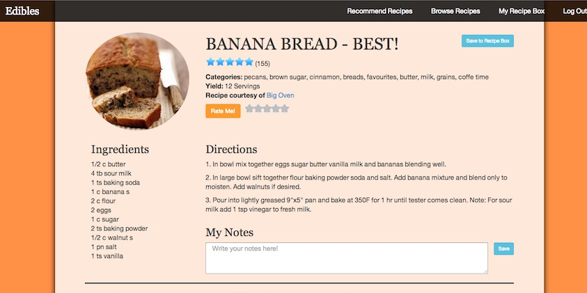

Edibles
===============

Edibles is a personalized recipe recommendation system designed using machine learning techniques. The recommendation algorithm predicts how much the user would like a new recipe based on how much the user has liked each ingredient of the recipe in the past. This ingredient data is gleaned from the user's rating history from prior recipes, and if unavailable, it is assumed that the user has neutral feelings toward the ingredient. Only the top predicted recipes are ultimately shown to the user. 

To showcase the recommendation system, when the recommendations are presented to the user, each recipe's thumbnail is scaled according to its predicted rating. Those with relatively higher predicted ratings are larger than those with relatively lower predicted ratings. 

On the individual recipe pages, users are able to rate, save, and annotate the recipe through a user-friendly interface.

Additional recipes can be accessed through the "Browse Recipes" page. Edibles is written using Python, SQLite, SQLAlchemy, Flask, Jinja, and HTML, CSS and Javascript. One of the most challenging parts of the project, in addition to the recipe recommendation algorithm, was figuring out how to create stars for user rating input and for displaying recipe ratings. This was ultimately accomplished through custom CSS and HTML.  